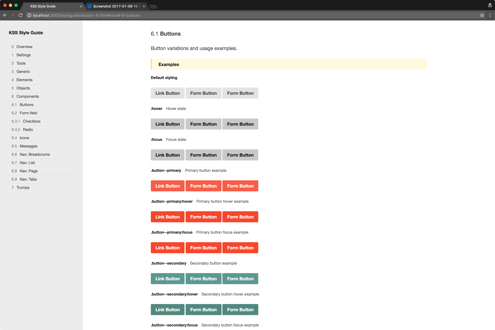

# Polar Starter

## Overview

Simple project starter that generates a style guide using [KSS](http://warpspire.com/kss/) methodology. Setup with Gulp. Place to learn, experiment and improve project delivery for clients.

## Getting Started

Install [node.js](http://nodejs.org).

	npm install gulp
	npm install

You are done.

### `gulp`

Use `gulp` for on–the–fly updates of your code (templates, js, css) and style guide.

### `gulp build`

This will create a `build` directory for project assets and templates and a `styleguide` directory from your KSS documentation in CSS **without browser-sync live preview**.

## Directory Structure

Feel free to modify everything in the `source` directory and keep in mind that `styleguide` and `build` directories are rebuilt with each `gulp build` command.

	gulpfile.js
	package.json
	readme.md
	source/
	├── assets/ [images, fonts, scripts, stylesheets]
	├── patterns/ [patterns that are included in templates]
	├── templates/ [page templates and flows]
	├── styleguide-template/ [modified KSS template for generating style guides]
	├── kss-config.json [style guide configuration]
	└── styleguide.md [description of the project and the style guide]

	build/ [generated via gulp]
	styleguide/ [generated via gulp]

## Additional Resources

More information about [style guides](http://www.styleguides.io/).

Articles and tools to start documenting interfaces and build style guides:

* [Documenting interfaces](http://polarnorth.org/blog/documenting-interfaces/)
* [Interface inventory](https://github.com/lucijanblagonic/interface-inventory/)
* [Moving the design process to the browser](http://polarnorth.org/blog/moving-the-design-process-to-the-browser/)